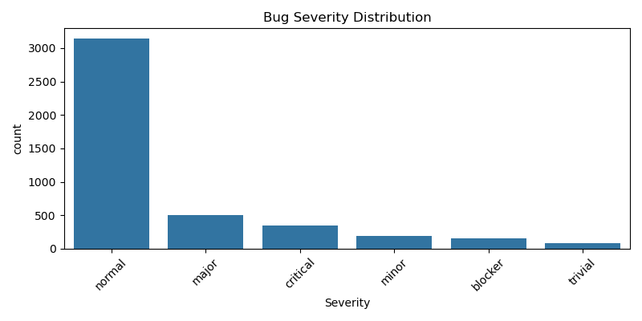
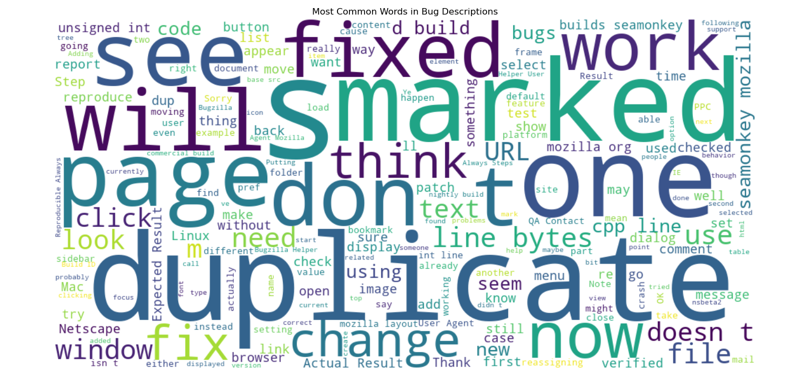

# 🐞 Bugzilla Bug Report Analysis

This project explores real-world bug reports using a dataset of ~4,400 entries from Bugzilla.  
It combines data cleaning, visualization, and early ML concepts — all tied to my QA engineering background.

## 🎯 Goals

- Practice data analysis using pandas & visualization tools
- Explore patterns in bug severity and description trends
- Build and deploy beginner-friendly ML models
- Showcase portfolio-ready code and visualizations

---

## 📁 Dataset

- Source: Bugzilla bug report dataset (from Kaggle)
- Sample: ~4,400 reports
- Key columns:
  - `Description`: the text of the bug
  - `Severity`: levels like normal, major, critical
  - `Label`: binary classification (e.g. valid/invalid)

---

## 🔍 Exploratory Data Analysis (EDA)

### ✅ What I Did

- Cleaned unnecessary columns
- Checked for missing values
- Calculated description lengths
- Visualized severity distribution

### 📊 Sample Visuals

#### Bug Severity Distribution

#### Word Cloud of Bug Descriptions

---

## 🤖 Future Work: ML Classification

Planned next steps:

- Predict `Label` from bug `Description` using:
  - `TfidfVectorizer`
  - Naive Bayes or Logistic Regression
- Evaluate model using accuracy and F1-score
- (Optional) Predict `Severity` as a multi-class problem

---

## 🧪 Why This Project Matters

As a former QA Engineer transitioning into Data Science, I’ve written and read hundreds of bug reports.  
This project merges real-world QA insights with modern DS tools — bridging both fields.

---

## 🛠️ Tech Stack

| Purpose            | Tools                                |
| ------------------ | ------------------------------------ |
| Data wrangling     | `pandas`, `numpy`                    |
| Visualization      | `matplotlib`, `seaborn`, `wordcloud` |
| Modeling (planned) | `scikit-learn`, `TfidfVectorizer`    |
| Notebook format    | `Jupyter Notebook`                   |
| Version control    | `Git`, `GitHub`                      |

---

## 📌 Folder Structure

bugzilla-analysis/
│
├── data/ ← Raw and cleaned CSVs
├── notebooks/ ← Jupyter notebooks
├── plots/ ← Saved visualizations
├── src/ ← Scripts (e.g. preprocessing, modeling)
└── README.md ← This file

---

## ✍️ Author

**Yuri Spizhovyi**  
MIT Emergent Talent Program (2024–2025)  
QA Engineer → Aspiring Data Scientist  
[GitHub Portfolio](https://github.com/yuri-spizhovyi-mit/bugzilla-bug-analysis)
